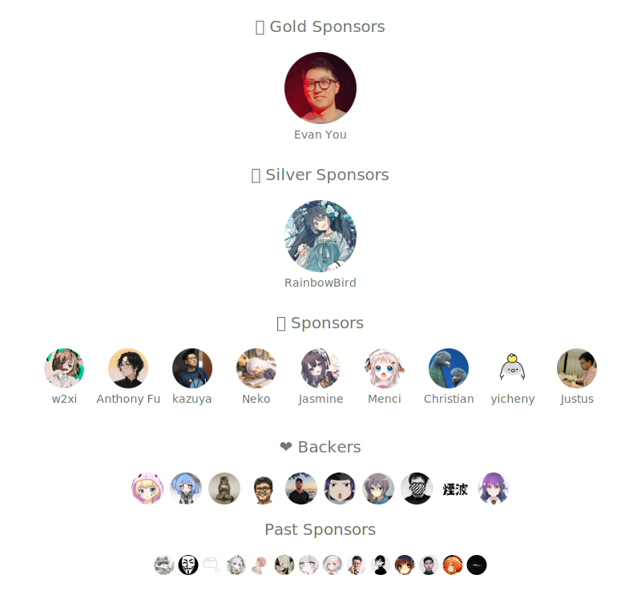

## Sponsors

If our code has helped you, please consider sponsoring us.

-  [Rizumu's GitHub Sponsor](https://github.com/sponsors/LittleSound)
-  [Neko's GitHub Sponsor](https://github.com/sponsors/nekomeowww)

<!-- -  Ethereum, Polygon: [xxx.eth](https://etherscan.io/address/xxxx) -->
<!-- - [Stripe](https://donate.stripe.com/xxx) -->
<!-- - [爱发电](https://afdian.com/a/xxx) -->

You can choose to sponsor any one or more of the people above. The sponsorship list below and for each project will combine and display your total sponsorship amount in order.

Thank you for your support!

## Doc

- [中国大陆用户指南 / Chinese Guide](./doc/chinese-guide.md)

## Contact

<!-- - Telegram: [@xxx](https://t.me/xxx) -->
<!-- - Twitter: [@OikawaRizumu](https://x.com/OikawaRizumu)
- Twitter: [@OikawaRizumu](https://x.com/OikawaRizumu) -->
- Discord: [Nolebase](https://discord.gg/XuNFDcDZGj)
- Telegram: [Nolebase](https://t.me/+6WKTUzWijf1kMzFl)

- Twitter:
  - [@OikawaRizumu](https://x.com/OikawaRizumu)
  - [@ayakaneko](https://x.com/ayakaneko)

  

## Thanks

Built with [SponsorKit](https://github.com/antfu/sponsorkit).

Reference from [sxzz/sponsors](https://github.com/sxzz/sponsors?tab=readme-ov-file).
